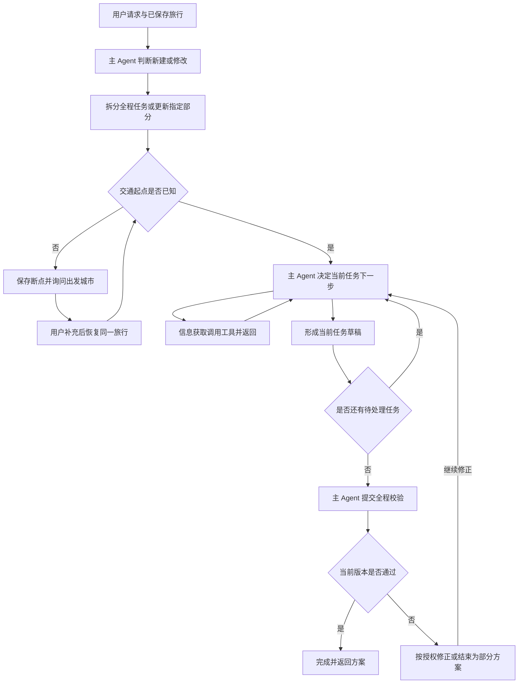

# 行程有据

基于 AgentScope 的命令行差旅助手。用户可以查询出行信息、管理偏好、询问企业差旅制度，或规划和修改多目的地旅行。

采用中心化主 Agent：主 Agent 理解需求并决定下一步，专业子 Agent 获取或整理信息，Harness 执行动作、保存状态并校验结果。旅行规划使用有界循环，逐段形成交通与住宿草稿，最后检查全程衔接。

**当前规划范围：火车与酒店地点推荐。** 不安排目的地景点活动，不估算酒店价格，不执行购票或订房。生产火车接口目前不可用；真实模型测评显式使用模拟火车和酒店供应商，模拟结果不代表真实可购买的票或房间。

## 目录

- [当前能力](#当前能力)
- [Agent、工具与 Harness](#agent工具与-harness)
- [请求链路与执行阶段](#请求链路与执行阶段)
- [意图识别与旅行修改](#意图识别与旅行修改)
- [任务、消息与循环结束](#任务消息与循环结束)
- [日期、停留时长与反问](#日期停留时长与反问)
- [候选、事实与版本校验](#候选事实与版本校验)
- [记忆、压缩与跨会话恢复](#记忆压缩与跨会话恢复)
- [Skill 与子 Agent 加载](#skill-与子-agent-加载)
- [执行预算与模型配置](#执行预算与模型配置)
- [本地运行](#本地运行)
- [测试、延迟与运行观测](#测试延迟与运行观测)
- [代码入口与设计文档](#代码入口与设计文档)

## 当前能力

| 能力 | 当前实现与边界 |
| --- | --- |
| 单站、多站旅行 | 按路线拆成有依赖的任务，安排火车与住宿，校验日期衔接 |
| 修改已有旅行 | 补条件、改条件、换火车或酒店、重做指定段、改路线、接受方案、暂停或取消规划 |
| 火车查询 | 保留聚合数据 Provider；当前服务失效，待更换。支持按出发日查询和本地按到达要求反查 |
| 酒店推荐 | 高德酒店地点搜索；名称、地址、位置及接口返回的其他地点信息可用，房价、房型、空房未知 |
| 天气与网页 | 信息获取调用天气或搜索工具，按实际返回提供来源；外部服务可能失败 |
| 攻略 | 已有工具入口，但 CLI 尚未注入攻略 Provider；不宣称景点活动规划已完成 |
| 飞机航班 | 当前没有航班查询和航班规划实现，作为后续扩展方向 |
| 企业制度问答 | 现有 RAG Agent 检索本地知识库并回答；本轮架构调整未修改 RAG 内部 |
| 偏好与记忆 | 保存长期偏好，读取同一用户历史和旅行，支持跨会话继续 |

酒店地点搜索只需要城市，可选品牌等关键词。高德 `business.cost` 不当作真实房价。没有硬报价或预算要求时，地点推荐可作为规划建议；用户要求严格核实房价或预算时，缺少报价会阻止规划被判为完整。

### 当前阶段与验证边界

当前已建立以行程规划为核心的Agent逻辑框架：主Agent识别意图、提出全程任务与停留方案；信息获取Agent整理条件并在工具循环中查询、补查和总结；Harness负责逐段执行、草稿、全程衔接检查、局部修改、断点及跨会话恢复。偏好和旅行记忆、压缩、懒加载、CLI入口熔断、运行记录与分阶段耗时也已有实现。

这个框架已通过已记录的离线回归和真实模型配模拟供应商的关键场景测评，包括多目的地规划、未给日期与停留时长、缺出发地后的恢复、定向换酒店和模糊反馈反问。可以据此说明主要调度和状态链路已经跑通，不能据此保证所有用户表达、复杂路线及外部故障组合都无问题。

现阶段可演示和验证的是火车与酒店地点范围内的规划建议生成、修改及保存；真实查询能否形成完整方案仍受Provider能力限制。生产火车接口失效待替换，酒店地点推荐已有接口，但真实价格、房型和空房未知；天气、网页及制度问答也依赖各自服务或知识库。完整火车酒店规划测评使用显式模拟数据，不代表现实中能买到对应车票或订到房间。

### 后续增量方向

后续主要沿现有架构完善业务能力，无需为了新增一个查询领域重新建立一套主Agent、记忆或执行框架。扩展仍要覆盖工具与Provider、结构化结果、Agent指南、workflow领域契约、候选引用与衔接校验，以及失败和修改场景测试；当前旅行workflow仅允许train/hotel，新增领域不会因为增加工具而自动进入规划。

| 方向 | 需要补充的内容 | 可复用的机制 |
| --- | --- | --- |
| 恢复真实火车查询 | 替换Provider，核对出发/抵达日期、车次、席别、票价和库存的来源与映射，做真实接口验证 | 查询工具、候选池、按到达要求反查、任务循环与时间校验 |
| 完善酒店业务数据 | 在地点推荐基础上，按需接入有来源的报价、房型、空房和入住规则；没有数据时继续披露未知项 | 信息获取、酒店候选引用、条件过滤与住宿任务 |
| 飞机航班查询和规划 | 航班工具与Provider、机场与航段数据、时区、转机及接续规则，扩展交通候选和领域校验 | 主Agent、逐段任务、信息获取循环、版本和记忆 |
| 景区推荐与旅游攻略 | 景点与攻略来源、开放时间、游览时长和地点信息，新增目的地活动安排及住宿/交通衔接规则 | 信息获取、工具接口、任务状态、来源记录和局部修改 |
| 提升真实运行质量 | 扩大真实业务与多轮测评覆盖，优化模型调用与上下文，完善按服务隔离的故障处理 | 遥测、测评脚本、运行预算、缓存与CLI入口熔断 |

这些是待实施方向，不能当作当前已支持的功能。“后续主要做增量”是对架构可复用性的判断，不代表真实业务接入和规划质量已经验收完成。

## Agent、工具与 Harness

### 主 Agent 与四个专业子 Agent

| 角色 | 运行名称 | 职责 | 是否调用 LLM |
| --- | --- | --- | --- |
| 主 Agent | `MainAgent` | 意图判断、首次任务拆分、决定补查、提出安排和综合结果 | 是 |
| 偏好 Agent | `preference` | 提取长期偏好变更，区分临时要求与长期偏好 | 是 |
| 记忆查询 Agent | `memory_query` | 读取个人历史、偏好及已保存旅行，回答历史问题 | 是 |
| 制度问答 Agent | `rag_knowledge` | 检索企业知识库，根据检索依据回答 | 有资料且模型可用时调用 |
| 信息获取 Agent | `information_query` | 整理条件、调用工具、检查结果、按需补查并总结 | 是，内部有工具调用循环 |

意图识别与行程生成属于主 Agent 的不同阶段。事项收集已融入信息获取的条件整理过程，没有单独的事项收集 Agent。火车、酒店、攻略查询是信息获取的内部工具，不作为主 Agent 调度的三个独立子 Agent。

### Harness：执行和状态管理

`ExecutionHarness` 与 `WorkflowRunner` 负责依赖执行、工具参数和修改范围检查、身份和版本管理、缓存、草稿、断点、保存、超时与结果校验。

Harness 自身没有独立的模型判断。代码中的 `OrchestrationAgent` 是 Harness 的兼容包装类，类名不表示额外的 LLM 编排层。

### 兼容入口与历史遗留

项目经历过多轮重构，旧名称、兼容消息和保留目录的状态不同：

| 项目 | 当前状态 |
| --- | --- |
| `OrchestrationAgent`类 | 保留旧名称的有效入口；CLI仍实例化它并调用继承自`ExecutionHarness`的`run_turn`，没有第二套独立编排引擎 |
| 原`OrchestrationAgent.reply(...)` | 已移除；当前CLI入口是`run_turn(context, run)` |
| `workflow_update`消息 | 仍支持旧更新结构；新设计主要使用带修改类型和目标范围的`travel_update` |
| `event-collection / train-search / hotel-search / travel-guide`旧Skill目录 | 指南文件仍保留，对应`script/agent.py`已移除；当前业务注册器不把它们作为独立子Agent调度 |
| `plan-trip/SKILL.md` | 主Agent仍读取的规划指南，不是独立行程规划子Agent |

当前主入口为`CLI → OrchestrationAgent → ExecutionHarness`，再分流到普通查询或`WorkflowRunner`旅行循环。保留兼容名称不表示它已废弃，保留旧目录也不表示相应旧Agent仍参与执行。本次说明只记录现状，未删除兼容协议或旧指南。

### 执行规则与运行组件

主 Agent 决定业务动作，程序验证后执行。任务 ID、版本和状态由程序管理；模型不能用文字绕过校验或宣告订票成功。

运行层还包括懒加载与熔断，当前由不同组件接入：

| 机制 | 实现和接入位置 | 职责 |
| --- | --- | --- |
| 子 Agent 懒加载 | `LazyAgentRegistry`，由 CLI 初始化并交给 Harness | 第一次按业务名称访问时导入、实例化子 Agent，后续复用缓存 |
| 入口熔断 | `CircuitBreaker`，在 CLI 请求入口检查、Harness 返回后记成功或失败 | 连续失败后暂停接收业务请求，等待恢复试探 |
| 旅行循环 | `WorkflowRunner`，由 `ExecutionHarness` 创建 | 执行有界决策循环、保存任务状态和检查全程安排 |

这些组件共同构成运行层；懒加载和入口熔断没有直接写在 `OrchestrationAgent` 包装类中。详细行为见下文“Skill 与子 Agent 加载”和“熔断与健康检查”。

### 信息获取的工具

| 工具 | 职责 |
| --- | --- |
| `train_search` | 按出发日期查询火车候选 |
| `train_search_by_arrival` | 按到达要求有界查询出发日期并筛选 |
| `hotel_search` | 查询酒店候选，当前 CLI 使用地点 Provider |
| `travel_guide` | 查询有来源的攻略资料，依赖实际配置的 Provider |
| `weather_query` | 查询天气 |
| `web_search` | 查询网页结果及来源 |

工具本身不调用 LLM。信息获取 Agent 调用模型决定工具和参数，在工具返回后继续检查、补查或总结。工具 schema 交给信息获取；旅行 workflow 中仅暴露当前授权的火车或酒店领域。执行器还会校验任务、参数、硬条件及组件范围。

## 请求链路与执行阶段

### 普通查询

```text
用户请求 + 会话上下文 + 用户偏好
  → 主 Agent 判断意图和所需角色
  → 按需执行偏好、记忆、制度查询
  → 信息获取：模型 → 工具 → 模型检查/补查/总结
  → 程序校验并返回，必要时由主 Agent 综合
```

例如“北京明天天气怎么样”只查天气，不创建旅行，也不自动查酒店。

完整且可独立回答的简单查询走 `answer + forward`：程序根据有来源的结果构造回答，主 Agent 不再调用一次模型总结。多角色综合或未完成的普通查询可以进入主 Agent 综合阶段；普通查询最多进行一轮主 Agent 反馈补查。

### 旅行规划



修正路径受次数和时间预算限制。已有草稿或一次循环结束，不代表全程成功；部分结果可以结束本轮，等待用户后续修改。

| 阶段 | 内容 | 作用 |
| --- | --- | --- |
| 前置阶段，priority 1 | 偏好、记忆、制度查询 | 后续使用本轮更新条件与相关依据 |
| 信息获取阶段，priority 2 | 条件整理、查询、补查、小结 | 提供普通回答或规划所需信息 |
| 主 Agent 综合/规划阶段 | 选候选、生成草稿、决定下一步 | 汇总并协调已有信息 |

前置任务按依赖执行，可并行。信息获取在本轮偏好更新之后运行，避免使用旧偏好。旅行 workflow 的信息获取由当前任务 `dispatch` 动作调用，不是一次性前置查询；主 Agent 会多次回到决策阶段。

`agent_schedule`也用于普通查询，表示首次决定要执行的专业子Agent及依赖；直接回答时为空。旅行规划的`agent_schedule`仅包含所需的偏好、记忆或制度前置任务，通常也可以为空。它与`workflow.tasks`不同：后者表示各段旅程，进入循环后由主Agent逐步返回`dispatch / draft_task / validate_workflow / finish`等动作推进，信息获取在`dispatch`时调用。

## 意图识别与旅行修改

先区分普通请求和旅行请求，再区分新建、恢复或修改。目标通过 `workflow_id / task_ids / components` 定位；组件为 `train / hotel / route / schedule`。

| 意图 | 处理 |
| --- | --- |
| `direct_answer` | 无需外部资料的直接回答 |
| `information_query` | 查火车、酒店、天气或网页，不自动创建旅行 |
| `preference_update` | 提取长期偏好变更 |
| `memory_query` | 查询个人历史 |
| `policy_query` | 查询企业制度 |
| `plan_trip` | 新建旅行，首次提出完整任务和停留方案 |
| `resume_trip` | 恢复旅行，复用仍有效的结果 |
| `explain_trip` / `trip_status_query` | 解释选择或查看缺口，不自动重查 |
| `supplement_conditions` | 补未知条件，如回答出发城市 |
| `change_conditions` | 改日期、人数、预算等已明确条件 |
| `regenerate_trip` / `regenerate_task` | 保留要求，重做全程或指定段 |
| `replace_train` / `replace_hotel` | 替换指定组件，保留其他选择 |
| `change_route` | 增删或重排目的地，重检依赖下游 |
| `adopt_plan` | 接受方案或候选，不等于交易成功 |
| `pause_or_cancel_planning` | 停止规划，不取消真实订单 |
| `clarify_feedback_scope` | “不满意”但范围不明时询问修改范围 |
| `unsupported_action` | 说明实际购票、订房和退改签能力限制 |

执行更新类型为 `supplement / change / regenerate / replace / change_route / adopt / pause / cancel`。单纯“不满意”不能清空条件或擅自重做整段。`change` 必须带明确、非空的条件变更；范围不明先保存 `feedback_scope` 断点。

例如“北京这段换全季，火车不变”只改酒店；“北京多住一天”更新停留并重检下游日期。相关结果按条件和版本复用，不一律重查全部工具。

## 任务、消息与循环结束

### 首次提案

上海→北京→杭州→上海拆为三段：到北京并在北京停留、到杭州并在杭州停留、返回上海。使用任务 ID 标识各段，不需要额外 leg/stop ID。

主 Agent 首次输出以下形式的提案。晚数是模型结合路线提出的建议，不是程序固定值：

```json
{
  "response_mode": "workflow",
  "finalization_mode": "synthesize",
  "agent_schedule": [],
  "workflow_proposal": {
    "confirmed_conditions": {},
    "tasks": [
      {
        "origin": "上海", "destination": "北京",
        "purpose": "visit", "requires_hotel": true,
        "conditions": {"departure_date": null, "nights": 3},
        "field_sources": {"nights": "proposal"}
      },
      {
        "origin": "北京", "destination": "杭州",
        "purpose": "visit", "requires_hotel": true,
        "conditions": {"nights": 2}, "field_sources": {"nights": "proposal"}
      },
      {
        "origin": "杭州", "destination": "上海",
        "purpose": "return", "requires_hotel": false,
        "conditions": {}, "field_sources": {}
      }
    ]
  }
}
```

Harness 校验后创建旅行和任务 ID。`purpose` 可为 `visit / business / return / transit / unspecified`；`requires_hotel` 独立控制住宿范围，返程通常无需酒店，明确要求时可安排。

| 状态字段 | 作用 |
| --- | --- |
| `id / revision / status` | 旅行身份、版本、整体状态 |
| `original_query` | 新建旅行时的用户原始需求 |
| `confirmed_conditions` | 全程明确条件 |
| `current_task_id / tasks` | 当前段及有序任务、条件、来源、依赖、草稿和缺口 |
| `results_by_query` | 按查询 ID 保存各段证据，不互相覆盖 |
| `candidate_cache` | 可恢复的候选池和缓存 |
| `checkpoint` | 必要条件或修改范围反问断点 |
| `validation` | 当前版本的全程校验结果 |

单任务包含 `id / revision / status / origin / destination / purpose / requires_hotel / depends_on / conditions / field_sources / draft_plan / summary / query_ids / issues`。更新时还可有 `update_scope`、拒绝候选等字段。

### 主 Agent → 子 Agent → 主 Agent

下面是裁剪后的消息示意，ID 为阅读示例，运行时由程序生成：

```json
{
  "type": "task_request",
  "workflow_id": "workflow_example", "task_id": "task_1", "task_revision": 1,
  "task": {
    "id": "task_1", "revision": 1,
    "mode": "complete_conditions", "purpose": "visit",
    "goal": "查询上海到北京的火车及北京酒店",
    "requested_domains": ["train", "hotel"],
    "query_requests": [
      {"domain": "train", "parameters": {
        "origin": "上海", "destination": "北京", "departure_date": "2026-10-17", "passengers": 1
      }},
      {"domain": "hotel", "parameters": {"city": "北京", "guests": 1}}
    ]
  },
  "context": {
    "original_query": "从上海去北京，再去杭州，最后回上海",
    "current_user_query": "从上海去北京，再去杭州，最后回上海",
    "effective_preferences": {"hotel_brands": ["全季"]},
    "effective_conditions": {"nights": 3},
    "previous_boundary": {}, "relevant_results": []
  }
}
```

实际上下文还包含完整工作流、任务概览、当前任务、`preflight` 可执行查询与缺项、字段来源、最新子结果和剩余预算。原始 query 可被主 Agent 和相关子 Agent 读取；结构化字段让它们按一致条件执行，避免每次重解释日期、人数和修改范围。

信息获取内部：读取条件 → 模型选择工具 → 程序检查并调用 → 候选或错误返回 → 模型补查或小结。返回示意如下，省略了候选和日期选项的实际内容：

```json
{
  "type": "task_result", "task_id": "task_1", "task_revision": 1,
  "agent": "information_query", "status": "ok",
  "summary": "已取得当前段候选，酒店为地点推荐，房价和库存未知。",
  "query_results": [
    {"id": "query_train_1", "domain": "train", "result_revision": 1, "items": []},
    {"id": "query_hotel_1", "domain": "hotel", "result_revision": 1, "items": []}
  ],
  "missing_fields": [], "date_options": [],
  "completed_conditions": {"nights": 3}, "field_sources": {"nights": "proposal"},
  "readiness": "ready", "issues": [],
  "execution": {
    "model_calls": 2, "tool_calls": 2, "external_requests": 2,
    "cache_hits": 0, "failed_calls": 0, "elapsed_ms": 3000, "stop_reason": null
  }
}
```

实际候选包含 ID、来源和查询时间。信息获取自己提供小结和执行情况；主 Agent 再选择候选，提交 `draft_task`，没有独立的“子结果总结 Agent”。

完整运行消息还带 `schema_version / message_id / turn_id / workflow_id / task_id / task_revision / in_reply_to`，关联请求、结果和版本。

### 主 Agent 动作与结束条件

| 动作 | 作用 |
| --- | --- |
| `dispatch` | 调用当前任务信息获取，补条件或查候选 |
| `draft_task` | 保存当前段选择、时间和小结，处理下一待执行段 |
| `ask_user` | 提出问题，Harness按当前允许范围决定是否保存断点 |
| `validate_workflow` | 检查全程当前版本草稿与依赖 |
| `finish` | 结束为完成或部分方案；completed必须通过全程校验 |

任务通常经历 `pending → running → draft → validated`，缺起点时可为 `needs_input`。旅行可为 `running / needs_input / partial / completed / paused / cancelled`，失败返回可以为 `error`。

`draft` 只代表已有草稿。后段不能早于前段可靠抵达和离店边界；前段修改会使依赖下游需要重检。所有必要安排和全程约束通过当前版本校验后才能完成。

模型可以在授权和预算内补查；无新信息、接口无法补出必要事实、动作重复、次数或时间耗尽时停止。用户后续补充或批准修改，再进入下一轮。

这是 **workflow 状态管理与 ReAct 式决策循环的组合**：程序规定合法动作和状态，模型根据工具观察选择下一步。

### 最终状态

| 状态 | 含义 |
| --- | --- |
| `ok` | 普通查询或回答成功 |
| `completed` | 旅行规划建议形成并通过全程校验 |
| `needs_input` | 保存断点，等待出发城市或修改范围等信息 |
| `partial` | 已有结果或草稿，仍有阻塞缺口 |
| `paused / cancelled` | 用户停止规划 |
| `unavailable / error` | 领域服务不可用或执行失败，具体看返回层级和原因 |

旅行结果包含 `status / finalization_method / final_answer / workflow_id / workflow_revision / workflow / validated_plan / stop_reason / gaps / results / missing_fields / data_mode`。普通查询可包含 `domain_results / travel_conditions`；旧行程兼容接口可有 `itinerary`。

最终事实由程序从可信证据重建。`completed` 不表示购票订房成功，也不表示建议日期已被用户确认或费用全部核实。费用显示已核实小计，未知费用单独说明，不当作零。

## 日期、停留时长与反问

| 条件 | 处理 |
| --- | --- |
| 首段完全缺日期 | 程序建议北京时间今天+7天，来源default；保存后不滚动 |
| 用户明确日期 | 保留用户要求，不自动改日 |
| 只说“2号”且缺月份 | 建议最近未来2号，标proposal并披露 |
| 只给到达日期/截止时间 | 写arrival_date/arrival_before，信息获取反查，不当作出发日期 |
| 未给停留时长 | 模型首次拆分逐站提出nights或入住离店方案，标proposal；程序不设默认晚数 |
| 模型遗漏住宿时长 | 最多让模型修复一次，仍遗漏报提案错误，不补固定晚数 |
| 未给人数 | 默认1人，住宿人数可由出行人数推导 |
| 未给预算、席别或品牌 | 不因这些缺省条件反复询问 |
| 交通规划缺出发城市 | 保存required_conditions断点，只问起点，暂不查火车或酒店 |
| 普通酒店/天气查询 | 不要求出发城市 |

按到达要求查询，是本地工具在到达日及此前最多两天的出发日期中筛选，不代表底层供应商支持到达时间查询。抵达日期必须有可靠证据；只有到达时刻而无日期，不猜是否跨夜。

建议出发日期查询成功但无候选时，可有界尝试后两天；接口不可用或报错不触发自动改日，用户固定日期不移动。

停留时长由模型结合旅行目的、路线、总时长和偏好思考。程序检查实际抵达、停留草稿及后段衔接，不默默覆盖硬条件。

## 候选、事实与版本校验

查询按 `query_id` 保存，绑定 `task_id / task_revision`，带参数、约束、来源、时间、候选和 `result_revision`。多段的火车酒店结果不会被一个领域字段覆盖。

模型选择只提交引用：

```json
{"query_id": "query_train_1", "result_revision": 1, "candidate_id": "candidate_train_1"}
```

程序检查候选属于当前任务和版本、满足约束且未被拒绝。revision区分修改后的状态，旧候选或迟到结果不能覆盖新版本。

默认每次给模型展示最多5个火车/酒店候选，原始池保留在缓存。`candidate_offset`查看后续窗口，不向火车接口发送虚构分页参数。高德最多获取25个地点；火车实际返回数量由接口决定，不保证返回5个。

有效重复查询优先复用缓存。恢复工作流时，过期非酒店地点证据按默认1小时阈值标记需重验；这不是供应商对报价或库存有效期的保证。刷新失败保留旧证据并标注需确认。

车次、酒店报价、库存、天气等不能由模型散文补造。需要酒店不自动意味着硬报价要求；模型标source=user也不能替代真实要求的来源检查。

## 记忆、压缩与跨会话恢复

### 文件分工

默认根目录为 `data/memory/`，不同用户隔离，同一用户可有多个会话：

```text
data/memory/{user_id}/
├─ profile.json                  # 偏好、来源与用户画像
├─ trips.json                    # 历史行程，兼容已有历史功能
├─ trip.md                       # 活动/近期旅行的可读摘要，可重建
├─ workflows/{workflow_id}.json   # 旅行、任务、证据、版本和断点的权威状态
└─ sessions/{session_id}/
   ├─ events.jsonl               # 追加的会话与执行事件
   ├─ state.json                 # 压缩摘要、覆盖边界、历史摘要缓存及活动旅行引用
   └─ runs.jsonl                 # 调度、模型调用、耗时、用量和运行记录
```

user_id标识用户，session_id标识会话，turn_id标识一轮请求。旅行身份由独立workflow_id保持，可以跨会话更新。

### 短期记忆如何进入上下文

`ShortTermMemory`是事件的内存投影，默认保留最近10个轮次，不是另一个短期记忆JSONL。持久化事件在events，摘要在state。

CLI每轮组合：当前query与北京时间、当前会话摘要、最近最多5轮用户/助手消息（排除本轮重复输入）、用户偏好和相关历史摘要。Harness再加入活动/相关旅行、保存的计划和断点。

子Agent接收所需query、条件、偏好、前置结果或当前任务；信息获取的工具调用与结果在其本轮模型消息中形成对话链。磁盘全部events和runs不会原样塞进每次提示词。

events记录程序实际保存的用户消息、最终助手结果、子Agent阶段、workflow消息和工具调用/结果；不是供应商所有原始请求、隐藏推理或网络过程的逐字记录。直接调用子Agent是执行阶段，不伪装成模型工具调用。

### 会话压缩

CLI每轮检查未压缩事件，默认约6000 token估算预算；目前按文本长度近似估算，不是精确tokenizer，也不代表全部提示词和旅行JSON的总长度上限。

1. 程序选取安全的旧事件前缀，追踪未完成工具调用。
2. 在工具配对完成、轮次或阶段完成等安全边界截断。
3. 模型根据旧摘要与选中事件更新摘要，保留目标、硬条件、已确认事实、重要结果和待处理事项。
4. 保存summary、covered_through_seq，后续读摘要及未覆盖近期消息。

默认保护近期轮次，长执行的已完成阶段仍可作为压缩边界。压缩不删除原始事件，也不替代权威旅行JSON；模型失败保留原始记录。CLI的clear清空短期上下文和摘要、记录清理边界，保留长期偏好与旅行，不撤销真实订单。

### 同一会话恢复与新会话

恢复相同user_id、session_id：从events和state重建短期上下文，继续使用摘要、近期消息和旅行断点。

同一用户新建session：本会话最初没有旧会话近期消息，但能读取用户偏好、相关历史摘要及未完成/已完成旅行JSON，无需重新发送旧会话全文。

历史会话摘要按会话缓存，有新消息才更新；当前相关性选择用文本匹配，用户问题最多选择3个相关摘要，无问题时选择最近一个，不是历史向量检索。

例如会话A说“去上海，安排火车和酒店” → 保存origin断点 → 会话B只答“重庆” → 识别为补起点 → 恢复同一workflow/task及原日期、晚数 → 查询并继续。已完成旅行也可在新会话被明确修改。

### 旅行长期状态与trip.md

workflows JSON保存部分方案、草稿、候选和版本，采用文件锁、版本校验、原子写入；拒绝其他会话已经修改后的旧版本覆盖，不自动重放外部查询。

trip.md从JSON重建，保留所有活动旅行及最近5个非活动旅行的任务详情；旧旅行保留索引和JSON路径。完整JSON不会因摘要缩短自动删除。此详情缩减由程序完成，不额外调用LLM。

启动或查询时可修复摘要；摘要失败不影响权威状态。手改trip.md不会直接改变旅行JSON。completed保存的是完成的规划建议，当前不会自动推断用户已经到站、入住或实际出行。

### 长期偏好与本次条件

长期偏好及来源保存在profile；本次日期、人数、预算、路线、临时品牌要求在旅行条件中。临时要求不自动成为长期偏好。

手动设置优先于Agent自动提取，手动删除有标记以防自动恢复：

```text
preferences
preferences set hotel_brands ["全季"]
preferences delete hotel_brands
```

## Skill 与子 Agent 加载

本项目用 `.claude/skills/`作能力目录，属于项目自定义加载机制。目录位置不决定某能力是否是Agent，也不自动提供执行隔离。

| 路径 | 作用 |
| --- | --- |
| `.claude/skills/preference/script/agent.py` | 偏好子Agent |
| `.claude/skills/memory-query/script/agent.py` | 记忆子Agent |
| `.claude/skills/ask-question/script/agent.py` | 现有RAG子Agent |
| `.claude/skills/query-info/script/agent.py` | 信息获取子Agent和工具循环 |
| `.claude/skills/plan-trip/SKILL.md` | 主Agent规划阶段指南 |
| `travel_data/` | 查询工具、Provider与事实保护 |

### 子 Agent 懒加载

`LazyAgentRegistry`启动时扫描`.claude/skills/*/script/agent.py`，记录目录到脚本的映射，不在扫描阶段导入或实例化所有子Agent。允许调度的业务名称只有`preference`、`memory_query`、`rag_knowledge`、`information_query`；旧能力目录中保留指南，不表示有对应独立Agent被当前主链路调度。

第一次执行`registry['information_query']`等访问时，注册器动态导入对应脚本，寻找`AgentBase`子类，注入共享模型和适用的记忆管理器后实例化。只有信息获取Agent额外注入`ToolExecutor`与Provider映射。实例保存到CLI进程中的缓存，后续访问直接复用；重新启动CLI会重新建立缓存。加载失败会抛出异常，不会将失败实例加入缓存。

```text
CLI启动 → 扫描脚本路径 → 创建注册器
Harness需要某个子Agent → 查询实例缓存
  已加载：返回缓存实例
  未加载：导入脚本 → 注入依赖并实例化 → 缓存 → 返回
```

主Agent在CLI初始化时直接创建，专业子Agent在首次使用时创建。懒加载减少启动时的导入和实例化开销，首次使用某个子Agent仍需支付加载成本。它不等于减少模型请求次数，也不提供独立进程隔离。

### Skill 指南读取与工具范围

SkillLoader按相关阶段读取指南，不把所有Skill全文交给每次模型调用。指南读取与子Agent实例懒加载是两个机制；主Agent使用的四个角色简介仍会进入首次决策提示词。

工具隔离由注册范围、requested_domains、update_scope、参数和版本校验实现；仅把指令放入Skill目录不会自动限制工具权限。

### 熔断与健康检查

`CircuitBreaker`由CLI初始化，每轮业务请求在压缩上下文和调用Harness之前执行`raise_if_open()`。打开状态下直接显示“服务暂时不可用，请稍后再试”，不进入本轮业务执行；用户输入仍已通过`start_turn`记录。

| 状态 | 行为和转换 |
| --- | --- |
| `closed` | 正常放行；默认连续5次失败后进入`open`，成功清零失败计数 |
| `open` | 拒绝新的业务请求；默认60秒后，在下一次检查状态时进入`half_open` |
| `half_open` | 允许后续请求试探；连续2次成功后回到`closed`，任意一次失败重新进入`open` |

阈值来自`config.py`中的`RESILIENCE_CONFIG`。当前计数以Harness整轮返回为准：`status == 'error'`或`run_turn`抛出异常记失败，其他状态包括`partial`和`needs_input`记成功。上下文压缩和历史摘要在这个结果计数的try块之外，其异常不会由该块记录到熔断器。

这是CLI进程内共享的入口保护，未分别给模型、火车Provider、酒店Provider配置独立熔断；某个工具失败但整轮返回部分方案，不会因此累计入口熔断失败。半开状态本身未实现并发试探限额，当前CLI按用户请求顺序执行。熔断状态不持久化到用户记忆，重启CLI后重新初始化。直接运行Harness的测评入口也不会自动经过CLI熔断。

会话内`health`显示当前熔断状态，并向模型服务发起一次最小健康检查请求；独立命令`python cli.py health`只进行服务检查。健康检查不会直接重置当前会话的熔断状态。`utils/llm_resilience.py`还提供指数退避重试函数，但当前CLI/Harness业务主链路未调用该自定义函数，不应把配置中的重试次数理解为整轮会自动重跑。

## 执行预算与模型配置

配置位于config.py：

| 限制 | 默认 |
| --- | ---: |
| 每次信息获取模型调用 | 最多6次 |
| 每次信息获取工具调用 | 最多10次 |
| 单工具超时 | 30秒 |
| 候选窗口 | 5个 |
| 普通查询反馈 | 最多1轮 |
| 每旅行任务的信息获取执行 | 最多3次 |
| workflow主Agent决策预算 | 每任务4步，加全程4步 |
| workflow工具预算 | 每任务10次的全程预算，并检查内部外部请求 |
| workflow整轮时限 | 600秒 |
| 非酒店地点证据重验阈值 | 1小时 |

多个预算共同生效，任何限制可提前结束。错误决定或提案有界修复，不无限重试；外部请求发出后，不因后续模型或记录失败重放整轮。

DeepSeek默认关闭推理：`extra_body={"thinking":{"type":"disabled"}}`。CLI、健康检查和测评使用统一生成参数；共享模型的主Agent、子Agent及记忆摘要继承此配置。温度0.7，输出上限8192 token。

关闭推理仍然调用模型完成意图判断、任务拆分、工具选择和规划，不关闭Agent循环。

## 本地运行

需要Python 3.11。在仓库根目录执行，Skill和注册器使用项目相对路径：

```powershell
python -m venv .venv
.\.venv\Scripts\Activate.ps1
python -m pip install -r requirements.txt
Copy-Item .env.example .env
```

Copy-Item用于首次创建配置；已有.env不要被空模板覆盖。设置本地配置：

| 配置项 | 用途 |
| --- | --- |
| LLM_API_KEY | 模型密钥 |
| LLM_BASE_URL | OpenAI兼容服务地址 |
| LLM_MODEL | 模型名，模板为deepseek-flash |
| AMAP_API_KEY | 高德酒店地点查询 |
| JUHE_TRAIN_API_KEY | 现有火车Provider密钥，接口故障未解决 |
| V0_RAG_DB_DIR | 可选本地向量库目录 |

密钥只放本地.env，不提交Git或复制到日志。相关服务缺配置时返回不可用，生产入口不会自动切换模拟供应商。

```powershell
python cli.py
python cli.py health
```

输入user_id，选择session_id恢复或回车新建。支持help、status、history、preferences、health、clear、exit，以及自然语言请求。

### 本地RAG

演示制度文档在 `.claude/skills/ask-question/data/documents/`，不代表真实企业规定。嵌入模型路径 `data/models/bge-small-zh-v1.5/`，向量库使用Milvus Lite。

准备模型和依赖后可初始化：

```powershell
python .claude/skills/ask-question/script/init_knowledge_base.py
```

初始化重建目标collection，已有需保留的库不应直接重建。Windows中文路径索引兼容问题可使用纯英文V0_RAG_DB_DIR。外部MODULAR-RAG-MCP-SERVER尚未在本次调整中替换现有RAG链路。

## 测试、延迟与运行观测

### 离线与真实模型测评

离线回归使用可控模型/供应商，不发真实模型请求：

```powershell
python -m pytest -q
```

2026-10-10 GitHub提交前最新完整回归为 **446通过、3跳过**（24.96秒），包含新增延迟脚本测试，1条既有DashScope弃用提示。这是本次工作树的验证结果，后续代码变更需重新运行；历史真实模型测评报告中的444项回归是当时的记录。

真实模型配显式模拟火车酒店供应商，会使用已配置模型API：

```powershell
python -m evals.run_preflight_simulated --output data/evals/preflight-new-run
```

输出逐案例JSON、模型响应、report.json、latency.csv和隔离测评记忆。模拟数据有来源标记，不证明真实价格、库存或接口恢复。

只想比较关闭VPN后的延迟，可以手动关闭VPN，再运行三场景脚本：

```powershell
powershell -NoProfile -ExecutionPolicy Bypass -File .\scripts\test_latency.ps1 -Label no-vpn
```

仅运行火车价格查询、单站火车酒店规划、多站未指定停留时长规划三个案例，每个一次，显式关闭模型思考。模型调用真实API，火车和酒店使用模拟供应商，适合观察模型链路延迟。脚本自动定位项目及Python，不更改或检测VPN、代理；`no-vpn`只是本次手动填写的标签。

终端显示总耗时、模型调用次数、初始决策、主Agent循环和信息获取耗时。结果保存到独立的`data/evals/latency-no-vpn-时间戳-随机后缀/`，包含`summary.md`、`summary.csv`、`run.log`和完整测评记录。失败案例仍保留耗时并返回非零退出码。开启VPN后，将同一命令的标签改为`-Label vpn`即可保留另一份结果作比较；三次样本只作初步观察。脚本测量Harness调用，CLI额外的压缩耗时不在本次计时内。

最新12个场景有通过记录：未给日期、缺起点与跨会话补起点、到达要求、查价、偏好更新、多段明确/未给晚数、替换酒店、解释、范围不明及暂停。最终复测中途问题与补测过程也保存在[测评报告](docs/evals/2026-10-10-stay-proposals-origin-clarification-evaluation.md)。

已有会话日志评分：

```powershell
python -m evals.v0_memory.runner --cases evals/v0_memory/cases.json --user-id USER_ID --session-id SESSION_ID
```

评分器读取既有日志，不发起新的业务请求。早期测评含估价和预算未通过记录，应按当时版本阅读，不代表当前价格能力。

### 定位延迟和失败

runs.jsonl记录模型阶段、完整调用耗时、输入输出token、首响应块时间、关联ID。工具记录含耗时、状态、缓存命中。模型费用只有配置价格并取得用量时才能估算，不是实际账单。

| 阶段 | 计时对象 |
| --- | --- |
| main:plan | 首次意图、拆任务或旅行更新的模型调用 |
| main:repair_decision / main:repair_proposal | 决定或提案修复 |
| main:step | 主Agent循环中的查询、草稿、校验和结束决定 |
| agent:information_query | 信息获取内部模型调用，含工具后检查/小结 |
| 其他Agent/综合阶段 | 偏好、记忆、制度及普通综合调用 |

“初始决策1.14秒”计时从请求发出到完整响应接收结束，包含网络等待和生成；首响应块延迟另记，不能视为严格首token延迟。工具可能并行，服务耗时不直接相加为总等待时间。

最新未给晚数的三段行程样本约25.14秒：主Agent循环12.80秒、信息获取模型10.72秒、初始决策1.14秒。供应商是模拟的，不能据此推算真实API延迟；这只是单次样本。

真实规划测评直接运行Harness；CLI额外的会话压缩和历史摘要更新可能产生模型调用，实际交互延迟还需看CLI完整记录。

排查时按turn_id关联首次决定、workflow_message、task版本、工具调用/结果及最终校验，查看stop_reason、missing_fields、gaps和耗时，区分条件遗漏、模型格式错误、接口故障、无合格候选、版本冲突和次数耗尽。

## 代码入口与设计文档

| 路径 | 职责 |
| --- | --- |
| cli.py | 交互、上下文组合、会话与模型初始化 |
| agents/main_agent.py | 意图、首次提案、逐步决策和综合 |
| agents/execution_harness.py | 依赖执行、直返、反馈、进入或恢复workflow |
| agents/workflow_runner.py | 有界循环、消息、调度、草稿和断点 |
| agents/workflow_contracts.py | 任务、动作与条件契约 |
| agents/planning_conditions.py | 日期准备、来源和可执行查询 |
| agents/travel_updates.py | 局部修改、组件保留和下游失效 |
| agents/workflow_queries.py / workflow_guard.py | 查询证据、候选引用、单段和全程校验 |
| agents/lazy_agent_registry.py | 四个专业子Agent加载与缓存 |
| utils/circuit_breaker.py | CLI入口熔断状态、失败计数和恢复试探 |
| utils/llm_resilience.py | 模型健康检查、可重试错误判断及退避重试工具函数 |
| .claude/skills/ | 子Agent脚本与阶段指南 |
| travel_data/ | Provider、工具、候选池与事实保护 |
| context/ | 事件、画像、短期上下文、压缩、旅行存储和遥测 |
| evals/ / tests/ | 真实测评、日志评分及离线回归 |

进一步阅读：

- [记忆设计](docs/design/v0-memory-redesign.md)
- [信息获取Agent设计](docs/superpowers/specs/2026-10-09-information-acquisition-agent-design.md)
- [多目的地交通住宿设计](docs/superpowers/specs/2026-10-09-multi-destination-train-hotel-workflow-design.md)
- [规划补全与修改规则](docs/superpowers/specs/2026-10-10-planning-preflight-design.md)
- [停留方案与起点反问测评](docs/evals/2026-10-10-stay-proposals-origin-clarification-evaluation.md)
- [默认关闭推理测评](docs/evals/2026-10-10-thinking-off-default-evaluation.md)
- [早期V0测评与局限](docs/evals/2026-10-08-v0-live-evaluation.md)

本仓库尚未附带开源许可证。
