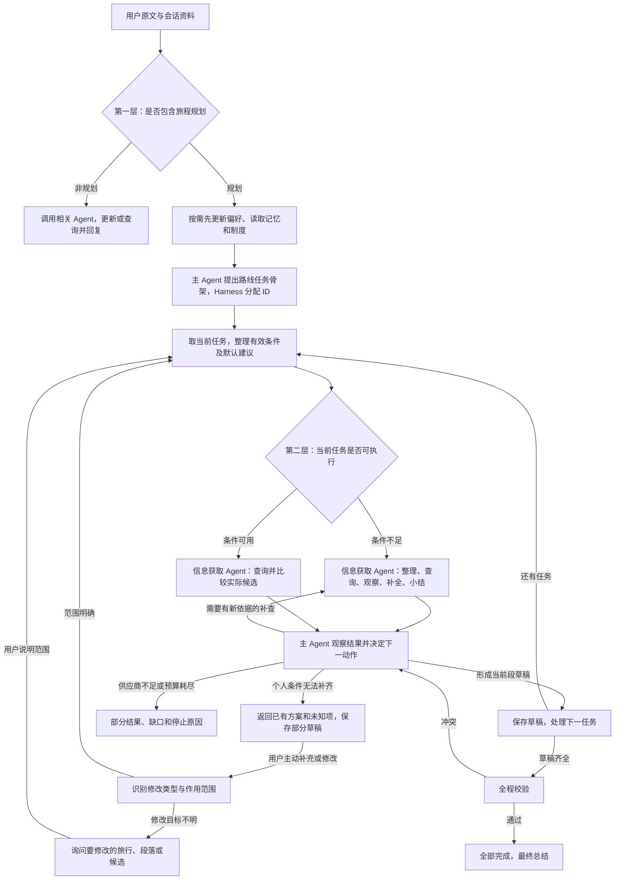

# 两层意图路由、任务拆分与规划前条件补全设计

日期：2026-10-10。状态：用户已确认，已按当前分支单代理方式实施；验证记录见 [测评报告](../../evals/2026-10-10-planning-preflight-evaluation.md)。

本项目当前未初始化 OpenSpec。本文件沿用现有正式设计目录，不创建 OpenSpec 项目结构。本文是对 [多目的地火车酒店工作流设计](2026-10-09-multi-destination-train-hotel-workflow-design.md) 的增量变更；实施后，本文的日期默认、任务骨架与执行条件、返程酒店例外取代旧设计对应规则，其余任务循环、版本、证据、暂停恢复及校验要求继续适用。详细步骤见[实施计划](../plans/2026-10-10-planning-preflight.md)。

## 1. 用户目标与范围

用户最新要求：主 Agent 第一层区分非旅程规划与旅程规划。非规划请求按需调用查询、偏好、记忆或制度 Agent 并回复，不生成旅行任务。规划请求先按出发地与目的地拆成顺序任务，并标注任务目的，再在第二层判断当前任务的条件是否可执行：完整时直接规划，缺项时先调用信息获取补全，再回到主 Agent 规划。

日期未提供时，可以主动建议当前北京时间日期的一周后；必要条件可以从上下文、默认规则、可靠推导和工具查询补齐。信息获取 Agent 在自己的 ReAct 循环中查询、观察、补查和总结，将结构化结果返回主 Agent。主 Agent 也以有界的决策、调用、观察循环编排任务，不是一次分派后只做一次总结。

本次修订明确取代初稿“补全后才创建任务”的顺序：先创建未执行的任务骨架，再补全当前任务。创建骨架不代表条件齐全，更不代表已完成或已订票。

第二次用户修订：首次请求不通过“补充必要个人条件”阻塞答复。先使用适用资料、默认值、建议与可执行查询给出已有方案；无法补齐的事实显示未知，输出部分草稿。用户看到方案后主动补充或提出修改，再识别修改类型和范围，更新同一旅行。仅当用户提出修改但无法定位旅行或不满意范围时，可以询问范围；不能借此重新要求用户填写全部旅行字段。

本次保留酒店地点推荐，不增加酒店估价或真实房价查询，不增加目的地游玩活动。RAG Agent 不变。火车供应商更换另行确认，不把某个新接口已接入或已验证作为本设计的事实。

这里不新增“信息识别 Agent”：整理条件、日期可行性查询和总结都属于现有信息获取 Agent。

## 2. 修改前实现与需要改变的边界

- `agents/main_agent.py:initialize` 首次模型调用就选择最终响应模式，并在 workflow 模式下生成整个任务提案。
- `agents/contracts.py:validate_plan` 禁止 workflow 的前置调度包含信息获取。
- `agents/execution_harness.py:run_turn` 在前置 Agent 执行前就试建并校验工作流，不能基于补全结果再确定任务。
- `agents/workflow_contracts.py` 没有目标到达日期条件；已有回归明确要求缺日期不默认今天。
- `travel_data/tools.py` 的火车工具必填出发地、目的地、出发日期；没有按到达日期查询的业务工具。
- `travel_data/juhe_train.py` 只解析到发时刻，未读取[聚合数据官方文档](https://www.juhe.cn/docs/api/id/817)列出的 `duration`，所以完整抵达时间缺失。文档字段存在不等于实际响应稳定，需样本验证。
- 信息获取已有有界工具循环，可复用；不重新建立另一套执行 Agent。

## 3. 方案选择

| 方案 | 优点 | 代价与问题 |
| --- | --- | --- |
| 只修改首次识别提示词，让模型补齐日期并立即建任务 | 修改少 | 没有车次证据就决定任务，无法实现用户要求的先查再决定 |
| 先区分请求类型；规划请求拆任务，再按当前任务条件调用信息获取（推荐） | 符合用户最新要求，保留主 Agent 编排、子 Agent 获取信息及全程校验，查询结果可复用 | 需要支持不完整任务骨架、任务目的及补全动作 |
| 将原工作流替换为完全开放的主 Agent 工具循环 | 自由度高 | 改动大，需重建已有任务状态、预算、暂停恢复及全程校验 |

采用第二种。两层是同一个主 Agent 的业务判断层次，不新增两个意图 Agent，也不强制每层分别调用一次模型。第一次可以识别规划目标并提出路线骨架，任务执行中仍持续判断下一动作。

## 4. 调度链路



只有需要时才进入补全阶段。条件完整表示工具参数可构造，不表示可以跳过真实车次或酒店查询。非规划的简单查询可以沿用现有信息获取和结果转交；无需外部信息的问答继续直接回答。用户同时更新偏好和要求规划时，执行偏好后继续规划，不能用互斥分类丢掉其中一项意图。旧工作流恢复须先加载版本和检查更新作用域，不能因补全而自动新建一份旅行。

偏好更新先完成，信息获取必须读到更新后的有效偏好。历史信息按需读取，不能为了一个明确的火车查询调用所有前置 Agent。

### 4.1 路线任务与任务目的

按“当前出发地 → 下一目的地，及该目的地需要的住宿”拆任务，继续沿用已有逐段设计。前段目的地衔接后段起点。只有用户明确给出的路线才能扩展目的地或返程；缺日期不妨碍先拆路线。

新增任务字段 `purpose`，枚举 `visit / business / return / transit / unspecified`，分别表示游玩、出差、返程、中转及未说明目的；增加 `purpose_source`（沿用 user/context/derived/default/proposal）记录依据。`requires_hotel` 继续作为独立的工具执行依据，不能仅凭目的字段决定。

例如用户说“上海去北京玩，再去杭州，最后回上海”：task1 上海→北京，purpose=visit；task2 北京→杭州，purpose=visit；task3 杭州→上海，purpose=return，通常 requires_hotel=false。若用户明确要求返程目的地酒店或中转过夜，则相关任务可为 true。这取代旧设计及旧校验中“末段返程一律禁止酒店”的绝对规则；默认返程不查酒店仍保留。

未说明目的时用 unspecified，不自行补成出差。不强制为了 purpose 追问。缺出发地但目的地明确时，允许骨架首段 origin=null，不能发起需要出发地的交通查询；先返回目的地酒店及交通待确定的草稿，用户后续补充时以同一 task ID 更新。若连目的地都无法确定，给出可选择的路线建议或通用安排框架，不生成没有路线的空任务，也不以追问作为首次答复的前置步骤。

任务 status 沿用 pending → draft → completed 及现有暂停/部分状态。pending 可以有未知必要字段；是否可执行由程序按查询目标和当前证据计算，不新增一套“信息齐全=任务成功”的状态。用户条件的变更沿用 revision 和下游重检。

未获得可核实交通候选时，允许保存有明确缺项的部分draft，选择字段可以为null；未知事实继续阻止completed，不因为允许草稿而绕过最终校验。当前段的缺口不阻止其他段独立可执行的酒店地点查询或已有固定日期的交通查询。推进下游时只能使用可靠时间边界或显式提案，不能用上游未知抵达时间伪造已核实衔接。本轮完成可执行部分后统一答复，不因第一处个人字段未知丢弃后续独立结果。

## 5. 条件来源与日期规则

### 5.1 规则

1. 用户明确要求优先于适用的会话条件、可靠推导和默认建议。矛盾不能由默认值消解。
2. 未给任何旅行日期、也没有适用的当前行程日期时，交通住宿规划默认建议北京时间今天加 7 个日历日出发。程序计算，模型解释；只在这一轮首次生成，恢复时不重新滚动加 7 天。
3. 默认日期属于 `default`，是可以调整的建议，不写入 `confirmed_conditions`，也不存为长期偏好。回复注明“先按 X 月 X 日出发安排”。
4. 用户给了到达日期时，保存到达要求；不能套用加 7 天覆盖，也不能把它改写成出发日期。
5. “明天”“下周五”结合北京时间解析；“2 号”等有缺失年月的表达优先用明确上下文。仍无法唯一判断时可以把最近未来的对应日作为显式假设，例如“暂按下个月2号理解”，来源proposal，保留原始表达；用户后续可纠正。不能静默将假设写成用户已确认的完整日期，也不能覆盖用户明确年月。
6. 出发地从本轮原文或适用于本次旅行的会话条件取得。历史某次旅行的出发地不能自动代表用户当前所在地。缺出发地时工具无法补出这个个人事实，先返回可执行的酒店地点推荐及交通未知项，不虚构起点，不主动追问出发地。
7. 人数继续默认 1，不为预算、席别或酒店品牌缺失追问。
8. 本次不新增固定三天旅行、固定住宿晚数或自动返程规则。用户未给天数时主 Agent 可以提出标注为proposal的停留区间草稿；优先使用户已有路线和时间要求可衔接。未知抵达时间不能以停留提案补成事实，无法衔接的部分仍列为未验证，不主动追问住宿晚数。
9. 目标是合理日期建议，不是宣称用户一定有空。工具能验证车次和时间，不能验证用户日程。

### 5.2 固定与灵活日期

- 明确出发日期：只查符合该日期的车次；调整日期须经过用户同意。
- 明确到达日期：允许自动查询能满足该日期的不同出发日期；这是满足既有要求，不是修改用户要求。
- 默认加 7 天：可以在建议范围内查看后续日期，所有调整继续标为建议。
- 成功查询无候选、接口不可用、超出预售窗口必须区分。不能把接口不可用说成没有车。
- 首次请求存在无法自动解决的硬条件冲突时，先返回可执行部分、冲突原因及调整方案，调整方案作为提案，不未经用户指示修改明确要求。后续用户选择或提出新要求后再更新，不通过强制个人信息追问阻塞首次答复。

## 6. 信息获取内部循环与日期工具

信息获取收到原文、当前 task ID/revision、完整任务概览、有效条件、来源和查询目标。在 `preflight_request` 作用域内可以整理缺项、调用火车或酒店工具、观察结果、按新依据补查、比较候选，最后生成小结。它不能创建旅行任务 ID、修改工作流状态或用户硬条件。

多目的地请求每次只补全当前任务，不预先执行整个多段任务循环。后续各段由主 Agent 结合前段可靠时间边界判断是否可直接查询或需要补全。不会给每一段重新套用“今天+7”，也不把原本待规划的下游日期全部视作首轮阻塞缺项。

增加业务工具 `train_search_by_arrival`，参数为 `origin`、`destination`、`arrival_date`、可选的 `arrival_before`（带时区的完整截止时刻）、`passengers` 和筛选条件。这是项目自己的封装，不声称供应商原生接受到达日期。

工具调用普通出发日期查询，按完整抵达时间筛选。历时必须是当前所查上车站到下车站之间的历时，不能拿整趟列车从始发站的跨日编号直接套用。优先使用供应商完整时间或经验证的区间历时；解析后交叉核对到达时刻。历时超过 24 小时、跨月跨年、中途站上车需专门验证。时间证据不足时保留未知，不用模型估计制造已核实时间。

初始有界参数（本设计待确认）：

- 默认出发日期建议依次查询 `今天+7`、`今天+8`、`今天+9`，取得满足条件的候选后停止。
- 按到达日期查询先尝试目标当日，再尝试前 1 日、前 2 日；每次依赖实际运行时间筛选，取得候选后停止。此范围不是对所有长途路线的完备搜索保证。
- 每次补全最多 3 个不同出发日期的外部查询；预算不足或范围不足返回明确缺口，而不宣称整个路线无可行方案。
- 信息获取沿用最多 6 次模型调用、10 次业务工具调用；上述封装中的每个真实外部请求都另计预算，不能因封装成一个工具绕过限制。
- 当前任务的补全和普通查询共用现有每任务最多 3 次信息获取执行额度；只有存在新查询依据才允许主 Agent 再调用。内部观察循环使用上述信息获取额度，不能在“补全”和“规划”两个阶段重复重置计数。用户补充、授权改条件后开启新的受限回合。
- 补全与后续候选查询、草稿和校验共用既有整轮时间限制（600 秒），并共用每任务 10 次、整轮 10×任务数的工具预算。封装内部每次外部查询纳入总计；阶段转换不重置计数和截止时间。

不承诺所有日期都有票。日期范围与供应商预售窗口求交；用户固定到达日期在窗口外时保留要求，说明暂不可核验，不能移动用户日期来凑结果。

## 7. 消息协议示例

示例日期是 2026-10-10，出发地“重庆”假设已从适用的会话上下文明确取得；如果没有，该字段应为 null。

### 7.1 主 Agent 初步理解输出

```json
{
  "phase": "intake",
  "intent_group": "travel_planning",
  "goal": "plan_train_hotel",
  "agent_schedule": [],
  "confirmed_conditions": {"destination": "上海"},
  "context_conditions": {"origin": "重庆"},
  "workflow_proposal": {
    "tasks": [
      {
        "origin": "重庆",
        "destination": "上海",
        "purpose": "visit",
        "purpose_source": "user",
        "requires_hotel": true,
        "conditions": {"departure_date": null},
        "field_sources": {"requires_hotel": "proposal"}
      }
    ]
  }
}
```

`goal` 是高层目标，`workflow_proposal` 是初步路线任务；模型不生成 ID/status/revision，Harness 校验骨架后分配这些字段。`confirmed_conditions` 只包含用户明确信息。上述请求级条件包含路线字段，与现有 workflow 的条件契约分开，由程序在建任务时投影。示例 requires_hotel=true 是普通住宿建议，可被用户“当天返回/不需要酒店”等条件覆盖，并须记录提案来源。

### 7.2 给信息获取的请求

```json
{
  "type": "preflight_request",
  "request_id": "prep_001",
  "workflow_id": "workflow_001",
  "task_id": "task_001",
  "task_revision": 1,
  "purpose": "visit",
  "requires_hotel": true,
  "original_query": "我要去上海玩，给我安排一下行程",
  "goal": "验证首段交通的可规划日期，并取得上海酒店地点候选",
  "effective_conditions": {
    "origin": "重庆",
    "destination": "上海",
    "preferred_departure_date": "2026-10-17",
    "passengers": 1
  },
  "field_sources": {
    "origin": "context",
    "destination": "user",
    "preferred_departure_date": "default",
    "passengers": "default"
  },
  "requested_domains": ["train", "hotel"]
}
```

### 7.3 信息获取返回

```json
{
  "type": "preflight_result",
  "request_id": "prep_001",
  "workflow_id": "workflow_001",
  "task_id": "task_001",
  "task_revision": 1,
  "status": "ready",
  "proposed_conditions": {"departure_date": "2026-10-17"},
  "field_sources": {"departure_date": "default"},
  "date_options": [
    {
      "departure_date": "2026-10-17",
      "arrival_date": "2026-10-18",
      "query_id": "query_train_001",
      "candidate_ids": ["train_001"],
      "time_evidence": "provider_segment_duration"
    }
  ],
  "query_result_refs": ["query_train_001", "query_hotel_001"],
  "missing_fields": [],
  "unverified_requirements": ["住宿晚数未确定；酒店房价和空房未查询"],
  "summary": "建议按一周后出发；已取得首段交通候选和上海酒店地点。"
}
```

这是协议示意，不是已查询的车次。`ready` 只表示达到明确的当前准备目标，可以进入当前段规划，不表示所有行程已完成、所有条件已验证或已经预订。后续段必要事实仍未知时，给出停留提案或部分草稿并返回已有方案，不删除或重新创建已有骨架，也不以填写个人信息作为前置条件。

`date_options` 的日期与证据引用由程序根据工具结果重建，模型不能自产事实。完整查询和候选池由程序保存，模型接收现有最多 5 个候选的视图及引用，不重复复制全部 API 响应。

返回状态：`ready`（满足准备目标）、`partial`（条件、证据或预算不足）、`unavailable`（所需供应商不能执行）。缺个人条件归partial并附missing_fields供主 Agent展示，不触发强制补充。`needs_input` 仅在修改目标需要澄清的交互使用。主 Agent 可以使用部分已取得的事实，不因一个字段未知丢弃酒店结果。

### 7.4 主 Agent 再决策与外层循环

非规划路径使用既有查询/更新与答复动作。规划路径沿用 `dispatch / draft_task / ask_user / validate_workflow / finish` 五种主 Agent 动作；`dispatch` 增加 `mode=complete_conditions/query_candidates` 区分补全与普通候选查询。任务齐全性、作用域及次数由程序校验，不允许模型通过切换 mode 绕过规则。

信息返回后，主 Agent 可以使用已有候选形成草稿、有新依据时补查、或条件/证据不足时finish partial，先给出可用方案；ask_user仅用于用户要求修改但目标无法确定的情况，不用于首次必填条件收集。所有草稿齐全后必须全程校验，通过才finish completed。这里的 ReAct 指依据可观察结果做有界动作选择，不要求输出或保存模型的内部思维链。

条件完整不等于所有任务已经完成，补全 ready 不等于 task completed。旧工作流恢复沿用已有用户更新和版本校验，只修改用户明确涉及的任务。到达约束在请求条件、任务条件、查询结果和最终校验中都保留，不得在交接时变成出发日期。

## 8. 证据复用、恢复与职责

- 主 Agent：两层意图判断、路线任务拆分与目的提取、决定默认建议适用性、补全或查询动作选择、任务规划、冲突处理和总结。
- 信息获取 Agent：整理有效查询条件、查日期和候选、内部有界循环、小结。
- Harness：默认日期计算、条件来源校验、预算与次数、查询记录、结果绑定、任务状态、暂停恢复。
- 工具适配器：真实 API 调用、历时/跨日字段解析、抵达时间计算与验证；模型不做事实补齐。

任务骨架、默认日期、有效条件、来源、补全结果和查询引用沿用工作流存储作为详细执行状态的权威来源；不再额外建立一份可以独立覆盖任务的 planning_context。缺个人信息时保存partial及已有草稿，返回答复；用户主动补充后恢复同一workflow/task ID，避免默认日期漂移。会话状态只保留已有活动工作流引用。明确的新请求不自动接续旧记录；用户说“修改之前的行程”而存在多个候选旅行时，允许询问要修改哪一份。

查询以规范化路线、完整参数、时间和来源保存，不能仅按 `train/hotel` 覆盖。准备查询从产生时就绑定至已有 task ID/revision；程序验证补全提案并更新条件时，必须判断这些结果能否绑定到更新后的任务版本，不复用被新要求否定的结果，也不让模型发明查询引用。价格与库存沿用现有 3600 秒时效要求，酒店地点沿用现有地点复用规则。继续执行既有事实和全程校验，不把准备阶段的 `ready` 当成工作流完成证据。

日志记录 `main_intake`、`planning_preflight`、`main_route`，工具真实调用、默认依据、停止原因和缺项均可追踪。日志不是用户长期偏好。

### 8.1 已有旅行的长期记忆：trip.md

用户要求把“已有旅行”写入长期旅行记忆 `trip.md`。当前代码与工作区实际使用 `data/memory/<user_id>/trips.json` 和 `workflows/<workflow_id>.json`，没有找到已有的trip.md；因此trip.md是本设计拟引入的文件，不描述为已经存在或已经接入。

拟使用 `data/memory/<user_id>/trip.md` 保存旅行摘要与检索索引，包括workflow_id（旅行稳定身份）、revision、总体状态、路线、日期及其来源、各task ID/目的/状态、已选火车与酒店摘要、未确定条件、最近修改和updated_at。Markdown用于长期记忆检索和模型可读摘要；完整候选池、查询证据、task版本和恢复断点继续保存在workflows JSON，不从自然语言摘要重建执行状态。

第一份可展示的完整或部分方案即更新trip.md，不等全部completed才记录。修改按workflow_id覆盖当前摘要，不把每次反馈追加成一趟新的旅行；方案记录明确属于planned_itinerary，不能把模型草稿当成用户已经出行或住宿的事实。

后续请求先读取相关旅行摘要；识别出明确目标后按workflow_id读取详细状态，再判断补充、修改或重生成。不能只查当前会话的active_workflow_ids，因为新会话和已completed的方案也可能被用户修改。活动及可能相关的已完成旅行按需检索，不把整个trip.md及所有候选池每轮塞入上下文。

trip.md由程序从已保存的工作流状态生成，记录同一revision；先提交工作流再更新摘要。摘要更新失败或版本落后时从最新JSON重建，不能用过时Markdown覆盖详细状态。已有trips.json历史保留并可投影至trip.md；只有包含真实workflow_id的记录才允许加载恢复，旧记录缺详细状态时只作为历史参考。迁移与同步必须幂等，不删除旧历史，不重复增加旅行统计。

这一安排将旅行记忆分成“长期可读摘要”和“可恢复的详细状态”，两者都跨会话持久化，但只有详细状态能决定任务版本及执行进度。

## 9. 技术影响与兼容

涉及 `agents/main_agent.py`、`agents/contracts.py`、`agents/execution_harness.py`，新增聚焦的准备状态与控制模块，避免继续扩大 Harness。

涉及 `agents/workflow_contracts.py`、`agents/workflow_runner.py` 和 `agents/workflow_guard.py`：支持不完整pending骨架和带缺项的部分draft，分别校验草稿可保存性与全程完成条件；增加 purpose/purpose_source、补全模式、目标到达日期与截止时间条件；返程酒店由 requires_hotel 决定。骨架连续性校验允许未知起点但不允许已知城市冲突，未知字段补齐后必须重检。保留旧快照读取、版本校验和用户条件优先级。旧任务无 purpose 时兼容为 unspecified，既有 requires_hotel 不变，不因为迁移自动重新推断。明确修改既有规划时默认加 7 天规则不介入。

涉及 `.claude/skills/query-info/script/agent.py`、对应 `SKILL.md`、`travel_data/tools.py`、`travel_data/contracts.py` 与适配器：补全过程、到达日期工具、历时解析、原始依据和预算计数。旧 `train_search` 参数保持可用。

涉及 `context/long_term_memory.py`、`context/memory_manager.py`、旅行摘要写入模块和记忆查询路径：首次草稿及后续修改同步trip.md，按workflow_id检索并恢复，兼容trips.json历史；详细状态仍由WorkflowStore原子写入及CAS保护。

仅在审批后更新旧设计及提示词中“缺日期一律不猜”的规则：用户个人事实与供应商事实仍不能猜，明确标注的日期建议可以按本设计生成。酒店价格规则保持不变。

## 10. 验收场景

| 编号 | 输入或条件 | 预期结果 |
| --- | --- | --- |
| P01 | 上下文明确重庆出发，用户说去上海、未给日期 | 先建 pending 路线任务，以北京时间今天+7作为建议，补全后规划，来源default |
| P02 | 相同请求缺出发地 | 骨架origin=null，执行可用酒店地点查询，返回部分草稿而不追问出发地；用户主动补充后ID不变 |
| P03 | 用户明确2号到达，年月在上下文确定 | 保留arrival_date，查询满足要求的出发日期，不强制当天出发 |
| P04 | 2号未提供月份且上下文不能确定 | 最近未来2号作为显式proposal，保留用户原文；不套用+7、不伪装为用户已确认年月 |
| P05 | 默认日期成功查询无合格车次、后一天有候选 | 自动给后一天建议并说明；不修改用户固定日期 |
| P06 | 供应商不可用 | 说明无法核验，返回已有资料，不能说没有车，不盲目扩大日期重试 |
| P07 | 同日、跨夜、历时超过24小时、中途上车、跨月跨年 | 采用经验证的区间时间证据；证据不足则未知 |
| P08 | 用户只问具体日期车票价格，条件完整 | 直接完成查询，不强制产生酒店或旅行任务 |
| P09 | 默认日期已保存，用户次日补充出发地 | 使用原建议日期，不重新滚动加7天 |
| P10 | 本轮更新偏好并要求规划 | 信息获取使用更新后的偏好 |
| P11 | 准备阶段已有匹配且有效的候选 | workflow复用查询证据，不重复调用接口；继续执行全程校验 |
| P12 | 用户修改既有task2 | 保留工作流ID和上游，应用现有版本和下游重检，不重新默认首段日期 |
| P13 | 默认日期与固定日期、到达要求冲突 | 用户要求优先；不能以建议覆盖 |
| P14 | 日期范围或次数用尽 | partial并说明已查范围和缺口；真实外部请求纳入预算 |
| P15 | 只有酒店地点、有酒店预算要求 | 房价未知，不能宣称预算已满足，不增加估价 |
| P16 | 用户仅要求去上海，未指定返程与停留天数 | 不自动新增返程或固定三天；允许标注停留提案，必要事实未知时返回部分方案而不追问 |
| P17 | 上海→北京→杭州→上海，最后明确返程 | 先拆三个稳定任务，目的分别visit/visit/return，返程默认不查酒店 |
| P18 | 用户明确要求返程目的地住宿 | purpose=return、requires_hotel=true，允许查询酒店，不因返程标签被拒绝 |
| P19 | 条件完整的规划请求 | 直接查询候选并规划，跳过无必要的补全，但不能跳过真实查询 |
| P20 | 非规划查询或仅更新偏好 | 调用相关Agent并回复，不生成旅行任务；混合偏好+规划两个意图均执行 |
| P21 | 第二段缺日期，但前段已有可靠衔接边界 | 推导第二段条件或定向补全，不重新套用今天+7、不重建任务 |
| P22 | 不同mode交替调用、结果版本失效或重复无进展 | 补全和普通查询共用次数预算，版本失效拒绝，无依据循环停止 |
| P23 | 用户说“北京这一段不满意” | 定位task1，仅重做该段，沿用未改变条件，重检时间依赖的下游 |
| P24 | 用户说“换掉北京酒店，其他别动” | 仅替换task1酒店，保留车次和其他段；拒绝候选不再次推荐 |
| P25 | 用户说“改成两个人、2号到” | 修改人数和到达约束，重新判断可查询性、证据与冲突，不一律当作整段重生成 |
| P26 | 用户只说“不满意”，无法定位旅行或范围 | 允许询问整个旅行/某段/火车/酒店，保存版本，不先重写全部方案 |
| P27 | 用户问“为什么选这个酒店” | 从已有依据解释，不自动替换候选或重查 |
| P28 | 用户明确提出一个新旅行 | 新建规划，不自动覆盖上一次partial或completed旅行 |
| P29 | 首段缺出发地，但其他目的地酒店可查 | 保留首段部分草稿，查询可独立执行的酒店；回复汇总已有结果，不伪造交通或阻塞所有任务 |
| P30 | 首次返回partial方案，用户新会话说继续上次旅行 | trip.md已有摘要，按workflow_id加载详细状态并继续，不重新默认日期 |
| P31 | 用户修改已completed旅行中的酒店 | 能从长期摘要定位已完成方案并加载详细状态；更新同一旅行，不只搜索活动旅行 |
| P32 | 修改同一旅行三次或重复运行迁移 | trip.md按workflow_id更新，不新增三趟旅行；旧历史不删除，统计不重复增加 |
| P33 | 摘要revision落后或摘要更新失败 | 以最新workflow JSON为依据重建摘要，不回滚详细状态，不重放外部查询 |

## 10.1 完整意图目录与修改作用域

以下是本次拟支持的业务意图目录，不代表当前代码已经实现所有类型。一个请求可以同时具有多个意图；不新增同数量的Agent。

| 意图 | 示例 | 执行路径 |
| --- | --- | --- |
| direct_answer | 问候、介绍助手能力 | 主Agent直接答复 |
| information_query | 查火车/酒店地点/天气/攻略/网页资料 | 信息获取；独立查询不自动改行程。攻略/网页等沿用现有能力及限制，不新增活动规划 |
| preference_update | 以后优先高铁、以后住全季 | 偏好Agent更新长期偏好并确认；本次临时要求不存长期 |
| memory_query | 我以前住过哪家、我的酒店偏好是什么 | 记忆Agent读取已有记录并答复 |
| policy_query | 公司住宿报销标准是多少 | 现有RAG Agent，能力边界不变 |
| plan_trip | 帮我安排去上海，或多目的地旅行 | 新建路线任务骨架，逐段补全/查询/规划 |
| resume_trip | 继续刚才的安排 | 恢复同一旅行，使用保存的条件和默认值 |
| explain_trip | 为什么选这班车/这家酒店 | 解释已有结果及选择依据，不自动修改 |
| trip_status_query | 哪一段还没安排好 | 读取任务状态、缺项和校验结果并答复，不自动重生成 |
| supplement_conditions | 我从重庆出发、我们有两个人 | 补充之前未知字段或明确用户条件，重检受影响内容 |
| change_conditions | 改到2号、预算改成2000 | 替换明确字段，已有证据不匹配则重新获取，不相关证据复用 |
| regenerate_trip | 整个方案重新安排，既有要求不变 | 全程重规划；保留已确认要求，不删除用户条件 |
| regenerate_task | 北京这一段重新安排 | 只重做指定段，沿用未改变要求，重检依赖下游 |
| replace_train | 这班车太早，换一个 | 定位task及train组件，提取时间条件或排除已拒绝候选，定向查询/选择 |
| replace_hotel | 换一家酒店，其他不变 | 定位task及hotel组件，提取品牌等条件或排除已拒绝候选，定向查询/选择 |
| change_route | 加苏州一站、删北京、先杭州再北京 | 更新任务拓扑，保留未改变任务身份，重检路线和依赖；新段分配新ID |
| adopt_plan | 就按这个方案、选第二家 | 保存对提案或候选的明确选择；不是购票、预订成功 |
| pause_or_cancel_planning | 先停一下、这次不规划了 | 停止后续查询并保存停止状态；不等于取消真实车票或酒店订单 |
| clarify_feedback_scope | 不满意/换一个，但无法定位对象 | 仅询问修改的旅行、段落或组件，不要求重填全部个人条件 |
| unsupported_action | 真正购票、酒店预订或退改签 | 说明当前只提供查询与推荐，可给出已有候选；不误报交易已完成 |

优先判断“新请求还是针对已有旅行”，然后判断“补充/改变条件、重生成、替换组件、解释、选择、继续或停止”。“查询北京天气”即使存在北京任务，也不能直接判为修改该任务；“北京这段换家酒店”才是有明确修改目标。

## 10.2 用户反馈后的链路

```text
用户新消息 + 活动旅行概览 + 最近展示的候选
  → 主Agent识别意图及目标workflow/task/component
  → 范围不明且确实要修改：询问修改范围，保存断点
  → 范围明确：生成最小更新/重新选择指令
  → Harness校验版本、更新字段/拒绝候选、使受影响结果失效
  → 重新判断当前任务的查询条件和选择依据
      → 可用：复用或定向查询候选
      → 不足：信息获取补全、补查或选择其他候选
  → 主Agent更新指定组件或任务草稿
  → 重检受影响下游和全程
  → 返回更新结果、变化说明及仍未知部分
```

不满意不必然等于必要条件不足。用户可以给了完整条件，但不喜欢模型选的酒店。这时条件仍完整，缺的是满意的候选或选择依据。识别结果分别记录 `missing_fields` 与 `selection_issues`，避免因“不满意”把原有完整条件清空。

作用域使用 `workflow_id / task_ids / components(train,hotel,route,schedule)`；更新类型使用 `supplement / change / regenerate / replace`。`condition_updates` 只记录用户明确新增或改变的要求；单纯重生成允许为空。`rejected_candidate_ids` 用于明确拒绝的候选，不能无用户依据排除全部同品牌或同路线结果。

例如用户说“北京这段换一家全季，其他不变”，请求级消息可以是：

```json
{
  "intent_group": "travel_update",
  "intents": ["replace_hotel", "change_conditions"],
  "target": {
    "workflow_id": "workflow_001",
    "task_ids": ["task_001"],
    "components": ["hotel"]
  },
  "update_type": "replace",
  "condition_updates": {"hotel_brands": ["全季"]},
  "rejected_candidate_ids": ["hotel_001"],
  "missing_fields": [],
  "selection_issues": ["用户要求替换当前酒店"]
}
```

这是请求级消息示意，品牌要求属于本次酒店筛选，不直接写入现有不支持该键的workflow条件，更不自动写入长期偏好；实施需定义组件筛选投影。主Agent不能因为用户只改酒店而自行换火车。若新酒店要求改变日期或位置后影响其他安排，先保留未授权组件，标出冲突和可选择的调整提案；只有用户明确选择后再修改对应条件。

已完成旅行也可以被明确修改：目标任务版本递增、状态回到draft/pending，工作流重新进入规划。只有最终校验通过才能再次completed；下游只因实际依赖失效而更新，不能一律重新调用全部工具。

实施先用可控模型及 Provider 写有意义的失败测试，再修改代码。真实模型测评至少覆盖 P01/P02/P03/P08/P10/P11，并用供应商真实样本验证 P07；接口不可用或凭据未配置时单独报告缺口，不能用离线候选冒充线上验证。

## 11. 后续实施顺序

1. 确认本文的两层意图、先拆任务再补全、任务目的、默认日期、首次先答复和反馈修改作用域。
2. 生成引用本文的详细实施计划，沿用用户选定的当前分支单代理方式。
3. TDD实现准备协议、日期工具和证据复用，再接入主 Agent 路由。
4. 更新技能与旧设计对应规则，整体自审并执行回归及真实模型测评。

本文尚未授权产品实施；本次只交付可审阅设计。

## 实施核对记录（2026-10-10）

已实施本设计P01–P33，证据与局限见测评报告及实施计划。运行时兼容与正确性处理包括：一致的重复路线字段由程序投影，矛盾拒绝；明确旅行更新统一进入执行流程；初始JSON错误最多修复一次；600秒预算覆盖首次判断和前置Agent。已完成旅行从详细JSON恢复，摘要失败不影响权威保存；活动旅行及近期5个非活动旅行保留详情，旧旅行保留索引并可按用户查询检索。

火车/酒店模拟仅显式注入测评入口，生产Provider不自动切换。RAG、活动规划、酒店估价和实际交易能力没有纳入本次实施。
