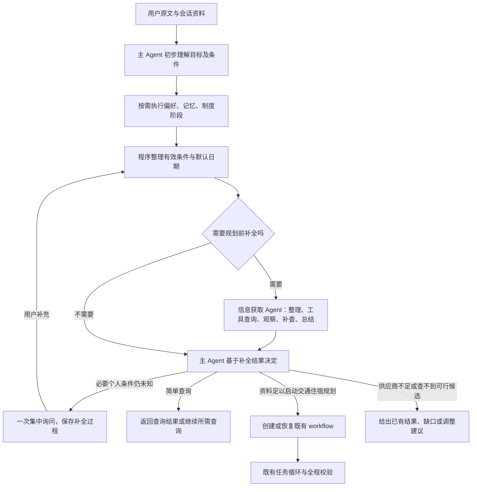

# 规划前条件补全与日期查询设计

日期：2026-10-10。状态：设计草案，待用户审阅；未修改产品代码。

本项目当前未初始化 OpenSpec。本文件沿用现有正式设计目录，不创建 OpenSpec 项目结构。本文是对 [多目的地火车酒店工作流设计](2026-10-09-multi-destination-train-hotel-workflow-design.md) 的增量变更；确认并实施后，本文的日期默认和工作流进入条件取代旧设计对应规则，其余任务循环、版本、证据、暂停恢复及校验要求继续适用。详细实施计划须在设计确认后生成。

## 1. 用户目标与范围

用户希望主 Agent 在创建旅行任务之前，先判断信息是否足够。日期未提供时，可以主动建议当前北京时间日期的一周后；必要条件可以从上下文、默认规则、可靠推导和工具查询补齐。信息获取 Agent 在自己的 ReAct 循环中查询、观察、补查和总结，将结构化结果返回主 Agent，由主 Agent 再决定直接回答、询问用户或进入既有工作流。

本次保留酒店地点推荐，不增加酒店估价或真实房价查询，不增加目的地游玩活动。RAG Agent 不变。火车供应商更换另行确认，不把某个新接口已接入或已验证作为本设计的事实。

这里不新增“信息识别 Agent”：整理条件、日期可行性查询和总结都属于现有信息获取 Agent。

## 2. 当前实现与需要改变的边界

- `agents/main_agent.py:initialize` 首次模型调用就选择最终响应模式，并在 workflow 模式下生成整个任务提案。
- `agents/contracts.py:validate_plan` 禁止 workflow 的前置调度包含信息获取。
- `agents/execution_harness.py:run_turn` 在前置 Agent 执行前就试建并校验工作流，不能基于补全结果再确定任务。
- `agents/workflow_contracts.py` 没有目标到达日期条件；已有回归明确要求缺日期不默认今天。
- `travel_data/tools.py` 的火车工具必填出发地、目的地、出发日期；没有按到达日期查询的业务工具。
- `travel_data/juhe_train.py` 只解析到发时刻，未读取[聚合数据官方文档](https://www.juhe.cn/docs/api/id/817)列出的 `duration`，所以完整抵达时间缺失。文档字段存在不等于实际响应稳定，需样本验证。
- 信息获取已有有界工具循环，可复用；不重新建立另一套执行 Agent。

## 3. 方案选择

| 方案 | 优点 | 代价与问题 |
| --- | --- | --- |
| 只修改首次识别提示词，让模型补齐日期并立即建任务 | 修改少 | 没有车次证据就决定任务，无法实现用户要求的先查再决定 |
| 在创建工作流前按需调用信息获取，再由主 Agent 决定最终路径（推荐） | 保留现有主 Agent 和子 Agent 边界，能复用查询，简单请求不增加无意义阶段 | 需要调整调度协议、日期工具和证据交接 |
| 将原工作流替换为完全开放的主 Agent 工具循环 | 自由度高 | 改动大，需重建已有任务状态、预算、暂停恢复及全程校验 |

采用第二种。最初仍需判断用户的大致目标，才能知道要查什么；推迟的是最终执行模式及旅行任务创建，而不是禁止首次理解意图。

## 4. 调度链路



只有需要时才进入补全阶段。条件完整的简单查询可以沿用现有信息获取和结果转交；无需外部信息的问答继续直接回答。旧工作流恢复须先加载版本和检查更新作用域，不能因补全而自动新建一份旅行。

偏好更新先完成，信息获取必须读到更新后的有效偏好。历史信息按需读取，不能为了一个明确的火车查询调用所有前置 Agent。

## 5. 条件来源与日期规则

### 5.1 规则

1. 用户明确要求优先于适用的会话条件、可靠推导和默认建议。矛盾不能由默认值消解。
2. 未给任何旅行日期、也没有适用的当前行程日期时，交通住宿规划默认建议北京时间今天加 7 个日历日出发。程序计算，模型解释；只在这一轮首次生成，恢复时不重新滚动加 7 天。
3. 默认日期属于 `default`，是可以调整的建议，不写入 `confirmed_conditions`，也不存为长期偏好。回复注明“先按 X 月 X 日出发安排”。
4. 用户给了到达日期时，保存到达要求；不能套用加 7 天覆盖，也不能把它改写成出发日期。
5. “明天”“下周五”结合北京时间解析；“2 号”等有缺失年月的表达优先用明确上下文。无法唯一判断时集中询问，不能偷偷改成下个月。
6. 出发地从本轮原文或适用于本次旅行的会话条件取得。历史某次旅行的出发地不能自动代表用户当前所在地。缺出发地时查询工具无法补出这个个人事实；可以先查询上海酒店地点，再集中询问。
7. 人数继续默认 1，不为预算、席别或酒店品牌缺失追问。
8. 本次不新增固定三天旅行、固定住宿晚数或自动返程规则。缺天数不阻止酒店地点推荐和首段交通查询；若它阻止后续交通住宿时间安排，再集中询问。
9. 目标是合理日期建议，不是宣称用户一定有空。工具能验证车次和时间，不能验证用户日程。

### 5.2 固定与灵活日期

- 明确出发日期：只查符合该日期的车次；调整日期须经过用户同意。
- 明确到达日期：允许自动查询能满足该日期的不同出发日期；这是满足既有要求，不是修改用户要求。
- 默认加 7 天：可以在建议范围内查看后续日期，所有调整继续标为建议。
- 成功查询无候选、接口不可用、超出预售窗口必须区分。不能把接口不可用说成没有车。

## 6. 信息获取内部循环与日期工具

信息获取收到原文、初步目标、有效条件、来源和查询目标。在 `preflight_request` 作用域内可以整理缺项、调用火车或酒店工具、观察结果、按新依据补查、比较候选，最后生成小结。它不能创建旅行任务 ID、修改工作流状态或用户硬条件。

多目的地请求在准备阶段只查询阻止启动规划的首段条件及可独立执行的首个目的地酒店地点，不预先执行整个多段任务循环。后续各段继续由原工作流结合前段时间边界查询，避免准备阶段重复规划全部旅行。

增加业务工具 `train_search_by_arrival`，参数为 `origin`、`destination`、`arrival_date`、可选的 `arrival_before`（带时区的完整截止时刻）、`passengers` 和筛选条件。这是项目自己的封装，不声称供应商原生接受到达日期。

工具调用普通出发日期查询，按完整抵达时间筛选。历时必须是当前所查上车站到下车站之间的历时，不能拿整趟列车从始发站的跨日编号直接套用。优先使用供应商完整时间或经验证的区间历时；解析后交叉核对到达时刻。历时超过 24 小时、跨月跨年、中途站上车需专门验证。时间证据不足时保留未知，不用模型估计制造已核实时间。

初始有界参数（本设计待确认）：

- 默认出发日期建议依次查询 `今天+7`、`今天+8`、`今天+9`，取得满足条件的候选后停止。
- 按到达日期查询先尝试目标当日，再尝试前 1 日、前 2 日；每次依赖实际运行时间筛选，取得候选后停止。此范围不是对所有长途路线的完备搜索保证。
- 每次补全最多 3 个不同出发日期的外部查询；预算不足或范围不足返回明确缺口，而不宣称整个路线无可行方案。
- 信息获取沿用最多 6 次模型调用、10 次业务工具调用；上述封装中的每个真实外部请求都另计预算，不能因封装成一个工具绕过限制。
- 同一轮规划前补全最多执行 1 次；查询与观察循环在信息获取内部完成。返回主 Agent 后不能无新依据反复重新补全。用户补充、授权改条件后开启新的受限回合。
- 与后续工作流共用既有整轮时间限制（600 秒）；补全已消耗的外部请求纳入整轮总计。进入工作流不重置整轮预算。

不承诺所有日期都有票。日期范围与供应商预售窗口求交；用户固定到达日期在窗口外时保留要求，说明暂不可核验，不能移动用户日期来凑结果。

## 7. 消息协议示例

示例日期是 2026-10-10，出发地“重庆”假设已从适用的会话上下文明确取得；如果没有，该字段应为 null。

### 7.1 主 Agent 初步理解输出

```json
{
  "phase": "intake",
  "goal": "plan_train_hotel",
  "agent_schedule": [],
  "confirmed_conditions": {"destination": "上海"},
  "context_conditions": {"origin": "重庆"},
  "needs_preflight": true
}
```

`goal` 是高层目标，不是旅行任务列表；`confirmed_conditions` 只包含用户明确信息。上述请求级条件包含路线字段，与现有 workflow 的条件契约分开，由程序在建任务时投影。

### 7.2 给信息获取的请求

```json
{
  "type": "preflight_request",
  "request_id": "prep_001",
  "original_query": "我要去上海玩，给我安排一下行程",
  "goal": "验证首段交通的可规划日期，并取得上海酒店地点候选",
  "effective_conditions": {
    "origin": "重庆",
    "destination": "上海",
    "preferred_departure_date": "2026-10-17",
    "passengers": 1
  },
  "field_sources": {
    "origin": "context",
    "destination": "user",
    "preferred_departure_date": "default",
    "passengers": "default"
  },
  "requested_domains": ["train", "hotel"]
}
```

### 7.3 信息获取返回

```json
{
  "type": "preflight_result",
  "request_id": "prep_001",
  "status": "ready",
  "proposed_conditions": {"departure_date": "2026-10-17"},
  "field_sources": {"departure_date": "default"},
  "date_options": [
    {
      "departure_date": "2026-10-17",
      "arrival_date": "2026-10-18",
      "query_id": "query_train_001",
      "candidate_ids": ["train_001"],
      "time_evidence": "provider_segment_duration"
    }
  ],
  "query_result_refs": ["query_train_001", "query_hotel_001"],
  "missing_fields": [],
  "unverified_requirements": ["住宿晚数未确定；酒店房价和空房未查询"],
  "summary": "建议按一周后出发；已取得首段交通候选和上海酒店地点。"
}
```

这是协议示意，不是已查询的车次。`ready` 只表示达到明确的当前准备目标，可以进入首段规划，不表示所有行程已完成、所有条件已验证或已经预订。主 Agent 若要安排后续段且住宿晚数仍是阻塞条件，应询问后再创建对应完整任务。

`date_options` 的日期与证据引用由程序根据工具结果重建，模型不能自产事实。完整查询和候选池由程序保存，模型接收现有最多 5 个候选的视图及引用，不重复复制全部 API 响应。

返回状态：`ready`（满足准备目标）、`needs_input`（仍缺必要个人条件）、`partial`（证据或预算不足）、`unavailable`（所需供应商不能执行）。主 Agent 可以使用部分已取得的事实，不因一个字段未知丢弃酒店结果。

### 7.4 主 Agent 再决策

输出动作限定为 `answer`、`ask_user`、`start_workflow`、`resume_workflow`；额外明确查询由已有信息获取路径执行，不把 `ready` 强行变成 `start_workflow`。

`start_workflow` 仍输出既有顺序任务提案；ID、revision 和 status 由 Harness 创建。`resume_workflow` 沿用已有用户更新和版本校验；只修改用户明确涉及的任务。到达约束在请求条件、任务条件、查询结果和最终校验中都保留，不得在交接时变成出发日期。

## 8. 证据复用、恢复与职责

- 主 Agent：初步目标判断、决定默认建议适用性、准备后再路由、任务规划、冲突处理和总结。
- 信息获取 Agent：整理有效查询条件、查日期和候选、内部有界循环、小结。
- Harness：默认日期计算、条件来源校验、预算与次数、查询记录、结果绑定、任务状态、暂停恢复。
- 工具适配器：真实 API 调用、历时/跨日字段解析、抵达时间计算与验证；模型不做事实补齐。

准备结果在同一请求的会话状态保存 `planning_context`，包括原文、默认日期、有效条件、来源和查询引用。缺个人信息时不创建空工作流。用户回复后沿用这份记录，避免默认日期漂移；新请求不自动接续旧记录，歧义时由主 Agent 询问。

查询以规范化路线、完整参数、时间和来源保存，不能仅按 `train/hotel` 覆盖。正式创建任务后由程序将匹配的准备查询绑定至 task ID/revision；不让模型发明查询引用。价格与库存沿用现有 3600 秒时效要求，酒店地点沿用现有地点复用规则。绑定后仍执行既有事实和全程校验，不把准备阶段的 `ready` 当成工作流完成证据。

日志记录 `main_intake`、`planning_preflight`、`main_route`，工具真实调用、默认依据、停止原因和缺项均可追踪。日志不是用户长期偏好。

## 9. 技术影响与兼容

涉及 `agents/main_agent.py`、`agents/contracts.py`、`agents/execution_harness.py`，新增聚焦的准备状态与控制模块，避免继续扩大 Harness。

涉及 `agents/workflow_contracts.py` 和 `agents/workflow_guard.py`：增加目标到达日期与截止时间条件，保留旧快照读取、版本校验和用户条件优先级。未含新字段的历史工作流照常恢复；明确修改既有规划时默认加 7 天规则不介入。

涉及 `.claude/skills/query-info/script/agent.py`、对应 `SKILL.md`、`travel_data/tools.py`、`travel_data/contracts.py` 与适配器：补全过程、到达日期工具、历时解析、原始依据和预算计数。旧 `train_search` 参数保持可用。

仅在审批后更新旧设计及提示词中“缺日期一律不猜”的规则：用户个人事实与供应商事实仍不能猜，明确标注的日期建议可以按本设计生成。酒店价格规则保持不变。

## 10. 验收场景

| 编号 | 输入或条件 | 预期结果 |
| --- | --- | --- |
| P01 | 上下文明确重庆出发，用户说去上海、未给日期 | 以北京时间今天+7作为建议，先补全再建任务，来源default |
| P02 | 相同请求缺出发地 | 先执行可用酒店地点查询，集中询问出发地，不伪造重庆或建空workflow |
| P03 | 用户明确2号到达，年月在上下文确定 | 保留arrival_date，查询满足要求的出发日期，不强制当天出发 |
| P04 | 2号的月份仍有重大歧义 | 一次确认，不用默认+7覆盖 |
| P05 | 默认日期成功查询无合格车次、后一天有候选 | 自动给后一天建议并说明；不修改用户固定日期 |
| P06 | 供应商不可用 | 说明无法核验，返回已有资料，不能说没有车，不盲目扩大日期重试 |
| P07 | 同日、跨夜、历时超过24小时、中途上车、跨月跨年 | 采用经验证的区间时间证据；证据不足则未知 |
| P08 | 用户只问具体日期车票价格，条件完整 | 直接完成查询，不强制产生酒店或旅行任务 |
| P09 | 默认日期已保存，用户次日补充出发地 | 使用原建议日期，不重新滚动加7天 |
| P10 | 本轮更新偏好并要求规划 | 信息获取使用更新后的偏好 |
| P11 | 准备阶段已有匹配且有效的候选 | workflow复用查询证据，不重复调用接口；继续执行全程校验 |
| P12 | 用户修改既有task2 | 保留工作流ID和上游，应用现有版本和下游重检，不重新默认首段日期 |
| P13 | 默认日期与固定日期、到达要求冲突 | 用户要求优先；不能以建议覆盖 |
| P14 | 日期范围或次数用尽 | partial并说明已查范围和缺口；真实外部请求纳入预算 |
| P15 | 只有酒店地点、有酒店预算要求 | 房价未知，不能宣称预算已满足，不增加估价 |
| P16 | 用户仅要求去上海，未指定返程与停留天数 | 不自动新增返程或固定三天；按当前目标推进，阻塞时集中询问 |

实施先用可控模型及 Provider 写有意义的失败测试，再修改代码。真实模型测评至少覆盖 P01/P02/P03/P08/P10/P11，并用供应商真实样本验证 P07；接口不可用或凭据未配置时单独报告缺口，不能用离线候选冒充线上验证。

## 11. 后续实施顺序

1. 确认本文的阶段边界、默认日期、日期搜索范围和缺个人信息处理。
2. 生成引用本文的详细实施计划，沿用用户选定的当前分支单代理方式。
3. TDD实现准备协议、日期工具和证据复用，再接入主 Agent 路由。
4. 更新技能与旧设计对应规则，整体自审并执行回归及真实模型测评。

本文尚未授权产品实施；本次只交付可审阅设计。
